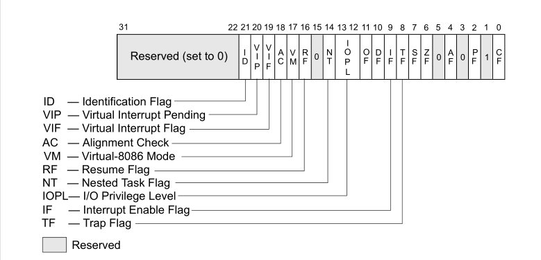
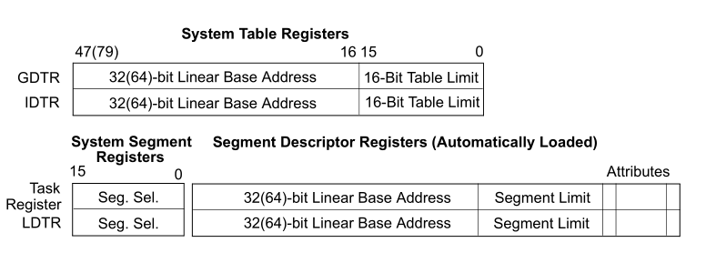
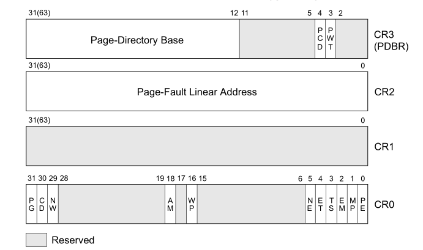
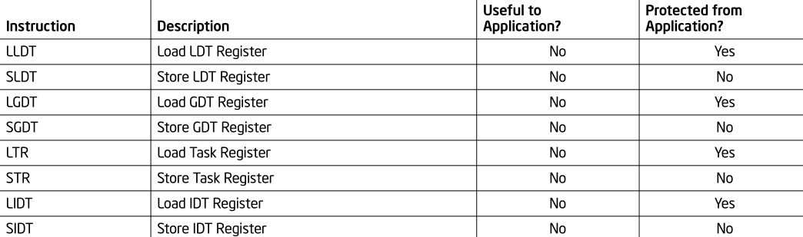

# 1.x86系统架构概览
## 1.1. 系统级体系结构概览
**①** 全局/局部描述符表GDT/LDT 表中存放了被称作**段描述符**的表项，这些表项提供**段的基址**以及访问权限、类型和使用信息。要寻址某个表项，需要的信息有  1）该表项位于哪个描述符表中(global/local flag) 2）描述符表在线性地址空间中的基址 3）该表项在描述符表中所处的位置(偏移) *第1和第3点信息，由段选择器(segment selector)提供(段选择器还提供了一些权限信息)* *第2点信息，则由GDTR和LDTR分别提供（LDTR实际上来自GDT中的一个表项）*  😀寻址段中某一字节的流程：段选择器+GDTR/LDTR→段描述符(段基址)→段内偏移
***
**②** System Segments, Segment Descriptors, and Gates 除了代码、数据和堆栈段之外，体系结构中还定义了两个系统段:任务状态段(TSS)和LDT。每个段都对应着一个段选择器  Gates(call gates, interrupt gates, trap gates, and 
task gates)是特殊的描述符，它们保护了较高特权级别的系统过程/程序，并且存放着目标代码段的**段选择器(segment selector)**和段内偏移  😀对call gate进行调用的流程：由**calling procedure**提供相应call gate的selector→硬件对该gate执行特权检查→若允许访问目标代码段，则从gate中获取目标代码段的位置（若需要更改特权级别，处理器也会切换到目标特权级别的堆栈）
***
**③** Task-State Segments and Task Gates 
TSS本质上是一个段，对应的段选择器存储在任务寄存器（TR）中。TSS包含了当前执行任务的**所有状态**： 1）通用寄存器、段寄存器、EFLAGS寄存器、EIP寄存器和段选择器（带有三个堆栈段的堆栈指针，每个特权级别对应一个堆栈） 2）该任务对应的LDT的段选择器和paging-structure hierarchy的基址  可以使用调用或跳转的方式切换到新任务（新任务的TSS的段选择器在CALL或JMP指令中给出），切换任务时处理器执行以下操作: 1）在当前TSS中存储当前任务的**状态** 2）将新任务的段选择器加载到TR中 3）由段选择器和GDTR寻址GDT中新任务的TSS段描述符 4）根据该描述符访问新任务的TSS 5）将TSS中的内容加载到通用寄存器、段寄存器、LDTR、控制寄存器CR3(存放paging-structure hierarchy的基址)、EFLAGS寄存器和EIP寄存器中 6）开始执行新任务  还可以通过任务门(Task Gates)访问任务,类似于调用门(call gates)，但是它提供的是对TSS的访问，而不是对代码段的访问
***
**④** 中断和异常处理 中断和异常都是通过中断描述符表(IDT)处理的。  IDT存放了一些gate描述符，包括中断、陷阱以及任务gate描述符，他们提供了对**中断和异常处理程序**的访问,具体的访问流程如下： 1）处理器获取中断向量（中断号），获取途径包括内部硬件、外部中断控制器以及软件方式（INT/INTO/INT3/BOUND指令） 2）由IDTR提供IDT的**基址**，中断向量提供**索引**即可寻址相应的gate 3）若被选择的gate是中断门或陷阱门，则以类似于*通过call gate访问目标代码段*的方式访问相关的**中断和异常处理程序**；如果选择的是task gate，则通过*任务切换*的方式访问处理程序。
***
**⑤** 存储管理 支持两种寻址模式： 1）通过物理地址直接寻址(将线性地址直接视为物理地址) 2）通过虚存（由分页机制实现）寻址  虚存管理包括以下内容： 1）将**段**进行**分页**,并将常用页面放置在主存中 2）这些页面在主存中的位置由**paging structures**指示 3）paging structures驻留在主存中，由各任务的CR3寄存器指示其基地址（**物理地址**） 4）paging structures中的每一个条目指示了一个页在主存中的基址、访问权限以及内存管理信息 5）线性地址为被分成多个部分，各部分分别用作paging structures**不同层级**中的索引  😀 基址 + 线性地址部分（索引） → 下一层级基址 + 线性地址部分（索引） → 下一层级基址 ...... + 线性地址部分（索引） → 实际寻址内容
***
**⑥** 系统寄存器 系统寄存器用于协助处理器初始化以及控制系统操作，包含以下内容：  • EFLAGS寄存器中的**系统标志**和**IOPL字段**控制任务和模式切换，中断处理，指令跟踪和访问权限  • 控制寄存器(CR0, CR2, CR3和CR4)包含各种*用于控制系统级别操作*的标志和数据字段,以及其他一些用于指示*操作系统或执行程序中对特定处理器功能支持*的标志  • 调试寄存器，用于在调试程序和系统软件时设置断点  • GDTR/LDTR/IDTR寄存器分别存放了它们对应的描述符表的基地址和表大小  • TR保存了当前任务的TSS的基地址和大小  • 模型特定寄存器（MSRs），是一组主要用于操作系统或executive procedures(特权级别为0的代码段)的寄存器，其数量和功能在Intel 64和IA-32处理器家族的不同成员中有所不同  大多数系统限制应用程序对系统寄存器(EFLAGS寄存器除外)的访问 😄然而，系统可以设计为所有程序和过程都运行在最高特权级别（特权级别0）。在这种情况下，应用程序将被允许修改系统寄存器。
## 1.2. 实模式和保护模式转换
处理器在上电或复位后处于实地址模式，之后由控制寄存器CR0中的PE标志控制处理器是在实地址模式还是保护模式下运行  **①** 从实模式到保护模式  
1）首先，软件初始化代码必须将**能够保证处理器在保护模式下可靠运行**的相应数据结构和代码模块的最小子集加载到内存中，包括： •GDT / TSS / LDT(可选) 
•如果要使用分页，至少要有一个页目录和一个页表 
•一个包含处理器切换到保护模式时要执行的代码段 
•必要的中断和异常处理程序  
2）然后，软件初始化代码还必须初始化以下系统寄存器： 
•（可选）IDTR（也可以在切换到保护模式之后，在启用中断之前立即初始化） 
•控制寄存器CR1-CR4 
•（仅限奔腾4、至强和P6系列处理器）内存类型范围寄存器(mtrr) 

😊初始化这些数据结构、代码模块和系统寄存器之后，处理器通过执行MOV CR0指令，在CR0寄存器中设置PE标志进入保护模式(在同一条指令中，寄存器CR0中的PG标志可以设置为1，表示启用分页)，保护模式下CPL初始为0
***
**②** 从保护模式到实模式  如果软件用MOV CR0指令清除CR0寄存器中的PE位，处理器将从保护模式切换回实地址模式。重新进入实地址模式的过程应该执行以下步骤: 1）禁止中断 
2）如果开启了分页功能，则需要执行以下操作:将程序控制转移到那些*线性地址等于物理地址*的页面上，并确保 GDT 和 IDT 在这些页面中，然后清除CR0寄存器中的PG位以取消分页，将 0H 移动到 CR3 寄存器以刷新 TLB 
3）将程序控制转移到一个限制为64kbytes（FFFFH）的可读段，该操作将向CS寄存器中载入实地址模式所需的段限制 
4）在段寄存器SS\DS\ES\FS\GS中为描述符载入selector（包含了一些实模式下合适的值） 
5）执行一条LIDT指令，向IDTR中载入中断表的基地址 
6）清楚 CR0 寄存器中的PE标志位 
7）执行far JMP指令跳转到实地址模式程序，此操作将刷新指令队列并向CS寄存器中加载适当的基址值 
8）根据实地址模式代码的需要向SS、DS、ES、FS和GS寄存器中载入值（如果某个寄存器不会在实模式中被使用，则置0） 
9）执行STI指令，启用中断
## 1.3. 80x86系统指令寄存器
**①**标志寄存器 EFLAGS  
EFLAGS寄存器中的系统标志位和IOPL字段控制I/O、可屏蔽的硬件中断、调试、任务切换和virtual-8086模式，只有特权代码(通常是操作系统或executive code)可以修改这些位 
EFLAGS寄存器中的系统标志位如下图所示：

其中，TF用于单步模式调试；IF用于设置是否响应可屏蔽硬件中断请求；IOPL显示当前运行的程序或任务的I/O权限级别；NT控制被中断和被调用任务之间的链接；RF控制处理器对指令断点条件的响应；VM用于启用virtual-8086模式；AC与访存时的对齐检查有关；VIF包含IF标志的虚拟映像；VIP由软件设置，表示中断正在等待;ID与CPUID指令相关
***
**②**内存管理寄存器  
内存管理寄存器包括GDTR、LDTR、IDTR和TR，用于指式**控制分段内存管理**的数据结构的位置。对这些寄存器进行存取值需要特殊的指令 内存管理寄存器示意图如下：
 
1）GDTR与IDTR： 
高位保存基址，低16位指定表中限定的字节数。处理器上电或复位时，基址为0，Limit为0FFFFH。在初始化保护模式的过程中，必须更新GDTR中的基址值；IDTR中的内容可以在处理器初始化过程中更新 
2）LDTR与TR： 
LDT与TSS的**段描述符**位于GDT中，寻址**段描述符**需要**段选择器**,而LDTR和TR的高16位就存储了**段选择器**，当使用LLDT/LTR指令更新LDTR或TR段选择器的内容时，相应段描述符中的基址、Limit和属性将自动加载到相应位中。 
处理器上电或复位时，基址为0，Limit为0FFFFH；切换任务时，硬件自动将**新任务LDT与TSS的段选择器和描述符**更新到LDTR和TR中，寄存器旧值不会自动保存。 
***
**③**控制寄存器  
控制寄存器用于确定处理器的工作模式和当前正在执行的任务的特征，其中CR0-CR3各位如下图所示，这些寄存器在所有32位模式和兼容模式下都是32位
 
•CR0 - 包含分页、Cache、写直达、对齐检查、写保护、错误报告、协处理器指令、保护模式等相关控制位 
•CR1 - 保留 
•CR2 - 包含导致页面错误的线性地址 
•CR3 - 包含paging-structure hierarchy基址高位（低12位假定为0）和两个**用于控制数据Cache中paging structure的缓存**的标志PCD和PWT
## 1.4. 系统指令
系统指令完成系统级功能，如系统寄存器值的存取、Cache管理、中断管理以及调试寄存器的设置。其中许多指令只能通过操作系统或executive procedures(即在特权级别0上运行的procedure)执行，当然有的也可以在任一特权级别上执行（即对应用程序可用）  
重点关注LGDT/SGDT LIDT/SIDT LLDT/SLDT LTR/STR指令 
下图为这些指令的描述以及执行权限：
 
LGDT/LIDT将基址和Limit从内存中加载到GDTR/IDTR中；SGDT/SIDT将GDTR/IDTR的内容保存到内存中 
LLDT/LTR将段选择器和段描述符从内存中加载到LDTR/TR中（段选择器可以来自通用寄存器）；SLDT/STR将LDTR/TR中的段选择器保存到内存或通用寄存器中 
