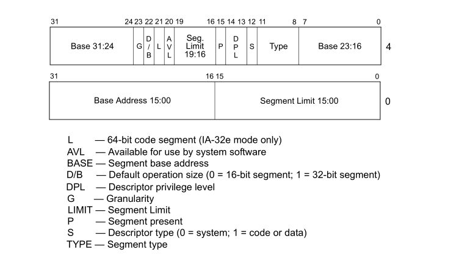
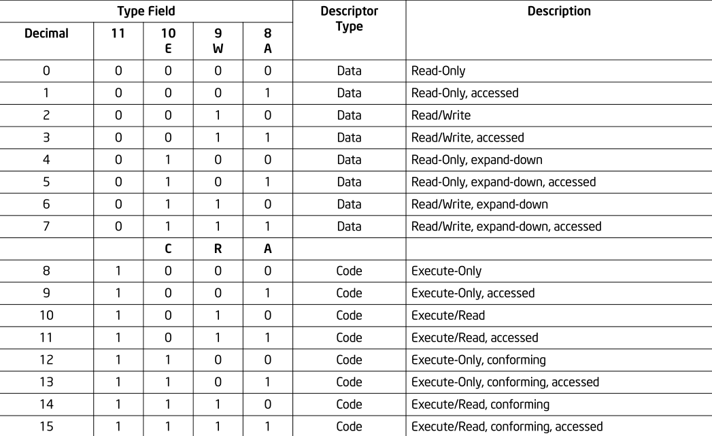
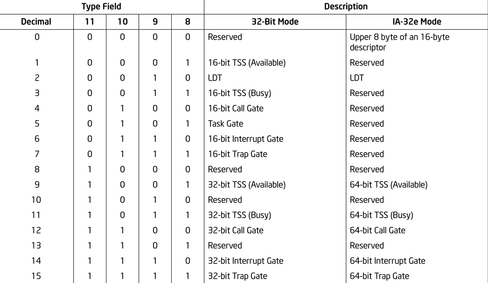

# 2. 保护模式内存管理
## 2.1. 内存管理概览
• 保护模式下，必须启用分段机制，而分页机制是可选的 
• 逻辑地址包括**段选择子**和**偏移**，段选择子用于索引描述符表中的段描述符，从而得到段基址，**段基址+偏移=线性地址** 
• 物理地址空间定义为处理器可以在其地址总线上生成的地址范围 
• 未启用分页机制时，线性地址=物理地址；启用分页机制时，处理器需要使用页目录和页表将线性地址转换为物理地址
## 2.2. 分段机制
**①** Basic Flat Model  
• 在这种模型下，必须创建至少两个段描述符，分别用于引用代码和数据段 
• 这两个段都映射到整个线性地址空间:即它们拥有相同的基址值0和段限制4GB 
• ROM通常位于物理地址空间的顶部，因为处理器从FFFF_FFF0H处开始取指执行；DRAM被放置在地址空间的底部，因为重置初始化后DS数据段的初始基址为0
***
**②**Protected Flat Model 
• 在这种模型下，段限制不再等于4GB，而是根据物理内存中实际存在的地址范围设置。当访问不存在的地址值时，会报出异常（#GP） 
• 为了使用分页机制隔离用户和supervisor的代码和数据，需要定义四个段：用户的权限级别为3的代码和数据段，supervisor的权限级别为0的代码和数据段 
***
**③**Multi-Segment Model 
• 该模型下，每个程序(或任务)都有各自的段和段描述符表（可完全私有，也可在程序之间共享），对系统上运行的各个程序的所有段和某个执行环境的访问由硬件控制 
• 访问的检查包括 
1）段限制外的引用地址 
2）非法操作 
3）访问权限
## 2.3. 逻辑地址和线性地址的转换
**①** 段选择子 
是一个16位的段标识符，如图所示： 
 
13位Index用于索引描述符；TI指示段描述符是位于GDT还是LDT中；RPL指示段选择子的特权级别  
***
**②** 段寄存器 
• 包含可见部分和隐藏部分，前者保存段选择子，后者保存相应段描述符的基址、段限制和访问控制信息 
• 将段基址和段限制缓存，省去了逻辑地址转换成线性地址过程中访存的开销 
• 对于几乎所有的程序而言，至少需要保证代码段(CS)、数据段(DS)和堆栈段(SS)寄存器必须装入有效的段选择子。此外，处理器还提供了三个额外的数据段寄存器(ES、FS和GS) 
• 在访问段之前，相应的段选择子必须已加载到一个段寄存器中 
• 可以使用直接加载指令显示向段寄存器中存值，也可以通过隐式加载指令附带地向段寄存器中存值  
***
**③** 段描述符 
位于GDT或LDT中，通常由编译器、链接器、加载器、操作系统或执行器创建，向处理器提供段的大小、位置以及访问控制和状态信息，其通用结构如下图所示： 
 
• 处理器将两个段限制字段放在一起，形成一个20位的值 
• 处理器将三个基址字段放在一起，形成一个32位的值。段基址应该是16字节对齐的 
• S指示是否是系统段，DPL指示段的特权级别 
• 根据段描述符是可执行代码段、向下展开数据段还是堆栈段，D/B位具有不同的含义 
***
逻辑地址包括段选择子和偏移量，处理器在将逻辑地址转换成线性地址的过程中完成了如下操作： 
1. 根据段选择子，从段寄存器中获取段描述符（若尚未被加载，则使用段选择子中的偏移量索引GDT或LDT中的段描述符，并将其读入段寄存器）
2. 查看段描述符相应位，以检查段的访问权限和范围，确保段是可访问的，并且偏移量在段的限制之内
3. 将段描述符中的段基址与逻辑地址中的偏移量相加，形成线性地址。
## 2.4. 描述符的分类
**①** 数据和代码段描述符 
{S,Type[3]}=10,该描述符为数据段描述符；{S,Type[3]}=11,该描述符为代码段描述符 
对于这两种段描述符，Type字段的低3位的不同组合具有不同的含义，如下图所示： 
 
• 注意，堆栈段必须是read/write段，若要求堆栈段大小动态可调，则可以将其设置为向下展开的段 
• 代码段的C位用于保护高特权级别的系统程序免受低特权级别的程序或过程的影响。当某代码段C=0时，在低特权级别下转移到该段可以使用调用门或任务门，否则会报异常(#GP) 
• 当目标代码段特权较低时，无论其C位是0还是1，都不能通过调用或跳转将执行转移到该代码段 
• 所有数据段都不能被特权较低的程序或过程访问，但是可以被高特权的程序或过程访问（不需要使用特殊的访问门）
***
**②** 系统描述符 
系统描述符的S位为0，包括**系统段描述符**和**门描述符**，通过Type域进一步指示不同描述符： 
 
1）门描述符其实就是门，包括调用、中断、陷阱和任务门，前三者保存了相应的程序入口地址，任务门描述符则保存了TSS的段选择子 
• 调用门描述符可以位于GDT或LDT中，但不位于IDT中 
• IDT中包含中断、陷阱和任务门描述符 
• 任务门描述符保存的TSS是属于中断和(或)异常处理任务的  
2）系统段描述符包含LDT描述符和TSS描述符： 
**TSS描述符** 
• 每个TSS只有一个指向它的描述符，并且该描述符只能放置在GDT中 
• CPL小于等于TSS描述符DPL的那些程序/过程可以通过调用或跳转分派任务。在大多数系统中，TSS描述符的DPL小于3，因此只有特权软件才能执行任务切换；但在多任务应用程序中，一些TSS描述符的DPL可以=3，这样就可以在应用程序/用户特权级别上进行任务切换 
**LDT描述符** 
• GDT必须包含LDT描述符，LDT描述符保存了LDT的基址、限制和访问权限，同时LDT也保存了其他一些段的段描述符 
• 一个LDT可以对应多个任务，但必须有唯一的段选择子和段描述符 
• 同其他的段一样，为了减少访问LDT时地址转换的开销，会使用一个寄存器LDTR保存它的段选择子以及段选择器中的一些内容  
