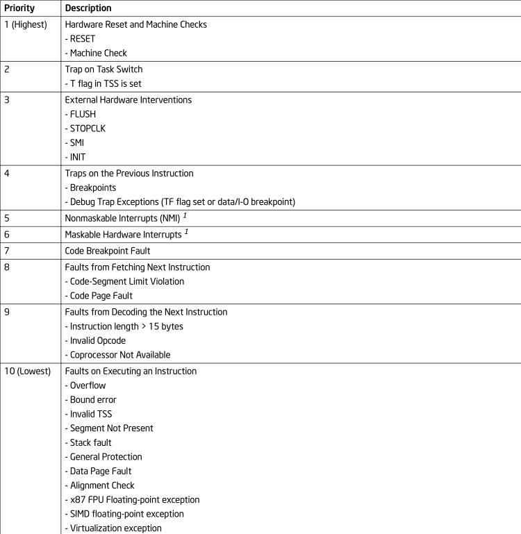
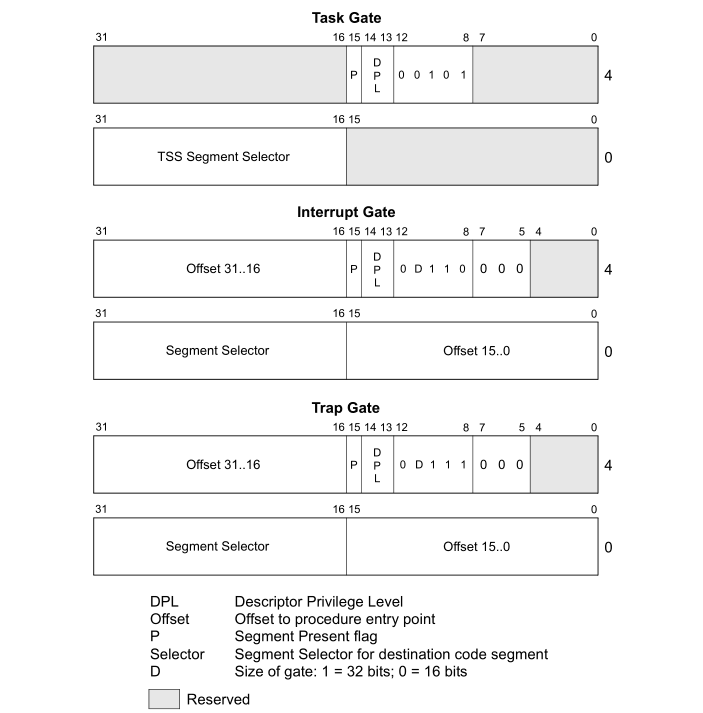

# 3. 中断和异常处理

## 3.1. 中断和异常处理概述

- 中断和异常是指示**硬件或当前执行程序**中存在`需要处理器注意的条件`的事件。它们通常会导致当前运行的程序或任务被切换到中断/异常处理程序。处理器响应中断或异常所采取的动作被称为服务或处理中断或异常。
- 当接收到中断或检测到异常时，处理器将挂起当前运行的过程和任务，并执行中断或异常处理程序。当处理程序的执行完成时，处理器恢复被中断的过程或任务的执行（除非不可能从异常中恢复，或者中断导致当前运行的程序终止）

## 3.2. 有关中断和异常了解性的内容

- 中断和异常向量
  - 每个异常和中断都被分配了一个唯一的标识号，称为向量号，作为中断描述符表(IDT)的索引
  - 向量个数的允许范围是0-255
    - 0到31的向量号由Intel 64和IA-32体系结构保留，这个范围内的部分向量没有相应的异常处理程序
    - 32到255之间的向量号为用户定义的中断，这些中断通常分配给外部I/O设备
- 中断源和异常源
  - 中断源包括`硬件生成中断`和`软件生成中断`
    - 当本地APIC为全局/硬件禁用时，外部中断通过INTR和NMI引脚接收。`INTR`指示外部中断(可屏蔽中断),处理器从系统总线上读取由外部中断控制器提供的中断向量号； `NMI`指示不可屏蔽中断,对应的中断向量号是2;
    - 软件生成中断：使用`INT n`指令，将中断向量号作为操作数，对中断处理程序进行隐式调用。这种中断是不能被EFLAGS寄存器中的IF标志所掩盖
  - 异常来源包括`程序错误` `软件生成异常` `机器检查异常`
    - 软件生成异常：`INTO` `INT 3` `BOUND` 指令,`INT n`指令也可用于模拟软件生成异常

- 异常的分类：故障、陷阱和中止
  - 故障通常可以纠正(若纠正，则不损失程序连续性),例如缺页异常。当故障被报告时，处理器将机器状态恢复到`开始执行故障指令之前`的状态。故障处理程序的返回地址(CS和EIP寄存器保存的内容)指向`故障指令`
  - 陷阱——陷阱是在`执行陷阱指令后`立即报告的异常。陷阱允许在`不损失程序连续性`的情况下继续执行程序或任务。陷阱处理程序的返回地址指向在`陷阱指令之后`要执行的指令。
  - 中止——中止是一种异常，它不总是报告导致异常的指令的`精确位置`，也`不允许重新启动`导致异常的程序或任务。中止用于报告严重的错误，例如硬件错误和系统表中不一致或非法的值。
  
- 程序或任务的重新执行(不损失程序连续性)
  - 故障`通常支持`任务重新执行，返回`引起故障的指令`
  - 陷阱`严格支持`任务重新执行，返回`陷阱下一条指令`(对跳转指令而言是其`目标指令`)
  - 中止`不支持`程序的重新知悉
  - 中断`严格支持`任务重新执行，返回到处理器`接收中断`时所执行指令的`下一条指令`
  
- 开启和禁止中断
  - EFLAGS中的IF标志位设0，屏蔽`可屏蔽中断`
    - IF复位时清0，STI/CTI PUSHF/POPF/IRET指令，以及通过中断门处理的中断都可能改变IF的值
    - 不影响不可屏蔽中断 以及 处理器生成的异常
  - RF指令用于屏蔽`调试异常`
  - 切换到不同堆栈段时，处理器在MOV to SS指令或POP to SS指令之后禁止中断、调试异常和单步陷阱异常，直到执行完下一条指令

- 异常和中断的优先级
  - 先处理较高优先级的中断/异常，较低优先级的异常被丢弃，较低优先级的中断被挂起
  - 当中断处理程序将执行返回到程序或任务中发生异常和/或中断的点时，将重新生成丢弃的异常
  - 优先级如图所示： 
   

## 3.3. 中断描述符表

- IDT是一个8字节的描述符数组(在保护模式下)，保存了中断/异常所对应的门描述符
- 😊`异常/中断向量` * `8` + `IDT基址` = 该异常/中断对应的门描述符线性地址，门描述符保存了相应处理程序的地址 
- `LIDT`和`SIDT`指令分别加载和存储IDTR寄存器的内容
  - LIDT指令将保存在内存中的`基址`和`限制`加载到IDTR寄存器中。该指令只能在`CPL为0`时执行，它通常位于`操作系统`在`创建IDT时`的初始化代码中。操作系统也可以使用它从一个IDT切换到另一个IDT。
  - SIDT指令将存储在IDTR中的基值和限制值复制到内存中。该指令可以在任何特权级别上执行。

## 3.4. IDT 描述符

- 任务门包含用于异常和/或中断处理程序任务的TSS的段选择器
- 中断门和陷阱门与调用门非常相似，它们包含一个远指针(段选择器和偏移量)，处理器使用它将程序执行转移到异常或中断处理程序代码段中的处理程序过程
- 下图显示了任务门、中断门和陷阱门描述符的格式 
   

## 3.5. 中断与异常处理

- 中断过程调用的流程
  - 当响应异常或中断时，处理器使用异常或中断向量索引IDT
  - 如果索引指向中断门或陷阱门，处理器会进行相应的特权检查和处理，若允许访问目标代码段，则根据描述符得到相应地址并跳转到该地址
  - 如果索引指向任务门，处理器执行`任务切换`，转移到异常或中断处理程序任务
  
- 如何判断中断处理过程与被中断任务的优先级
  - 中断处理程序所在段的`段描述符`(通过门描述符中的段选择子得到)中的`DPL`指示了中断处理程序的特权级别，CS寄存器中的`CPL`保存了被中断任务的特权级别
  - 数值小->级别高
  - 中断处理过程优先级较高：需要进行堆栈切换，处理器需要完成以下操作:
    - 从TSS中获取处理程序要使用的`堆栈段`的`段选择子`和`栈指针`，并将被中断过程的堆栈段的段选择子和栈指针`压栈`
    - 在`新堆栈`上保存EFLAGS, CS和EIP寄存器的当前值
    - 如果异常导致错误码被保存，则在`新堆栈`中将错误码压入EIP值之后
  - 优先级相同：不需要进行堆栈切换，处理器需要完成以下操作:
    - 在`当前堆栈`上保存EFLAGS, CS和EIP寄存器的当前值
    - 如果异常导致错误码被保存，则在`当前堆栈`中将错误码压入EIP值之后

- 从中断处理过程返回
  - 使用IRET(或IRETD)指令返回，处理器完成以下操作：
    - 恢复IP
    - 恢复CS
    - 恢复EFLAGS
    - 若调用处理程序过程时发生堆栈切换，则IRET指令在返回时切换回被中断过程的堆栈

- 异常和中断处理过程的保护
  - 不允许将执行转移到比`CPL`优先级`更低`的代码段（数值上更高）中的`异常或中断处理程序`
  - `不检查`RPL 
  - 对于`硬件产生中断`和`处理器检测到的异常`，忽略`DPL`
  - 当异常或中断由INT n、INT 3或INTO指令产生时，检查`DPL`:
    - CPL必须`小于或等于`gate的DPL（优先级更高），防止在特权级别3上运行的应用程序或过程使用软件中断访问关键异常处理程序

- 异常和中断处理过程的标志使用方式
  - 当通过中断门或陷阱门访问异常或中断处理程序时，处理器
    - 将EFLAGS寄存器值压栈，然后清除EFLAGS寄存器中的TF标志
      - 清除TF标志可以防止指令跟踪影响中断响应
    - 在调用异常和中断处理程序时，还清除EFLAGS寄存器中的VM、RF和NT标志
  - 用于中断返回的IRET指令将TF(以及VM、RF和NT)标志恢复为之前在堆栈上保存的值
  
  - 中断门与陷阱门的唯一区别是`处理IF标志的方式`:
    - 当通过中断门访问异常或中断处理过程时，处理器清除IF标志以防止其他中断干扰当前中断处理程序。IRET指令之前保存在栈上的EFLAGS的值恢复IF标志位
    - 通过陷阱门访问处理程序过程不会影响IF标志
 

  